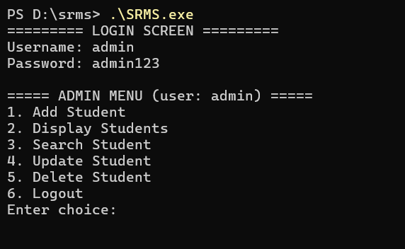
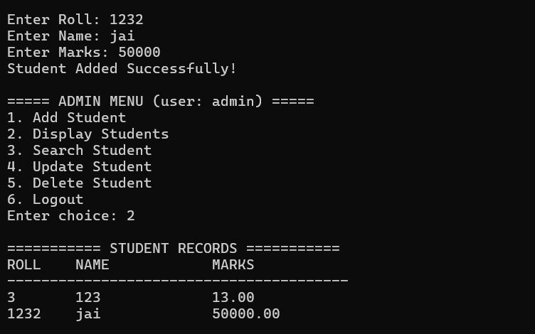

# Student Record Management System (SRMS)

Simple terminal-based student record management system with a lightweight SQLite backend and a clearer CLI.

**Build (Windows PowerShell)**

```
cd "d:\srms\"
# Compile linking with sqlite3 (ensure sqlite3 dev libs/headers are installed)
gcc SRMS.C -o SRMS -lsqlite3
```

**Run**

```
cd "d:\srms\"
.\SRMS
```

**Notes**
- If you have existing `students.txt` or `credentials.txt`, the program will migrate their entries into `students.db` on first run.
- A default admin account is created if no credentials exist: username `admin`, password `admin` (please change after first login).

**Screenshots**

Below are two example screenshots from the `ss` folder showing the login screen and the add-student screen.

| Login Screen | Add Student Screen |
|---:|:---|
|  |  |

